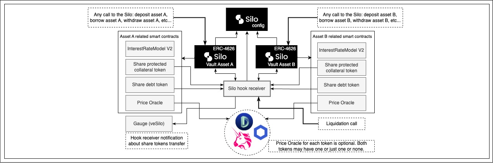
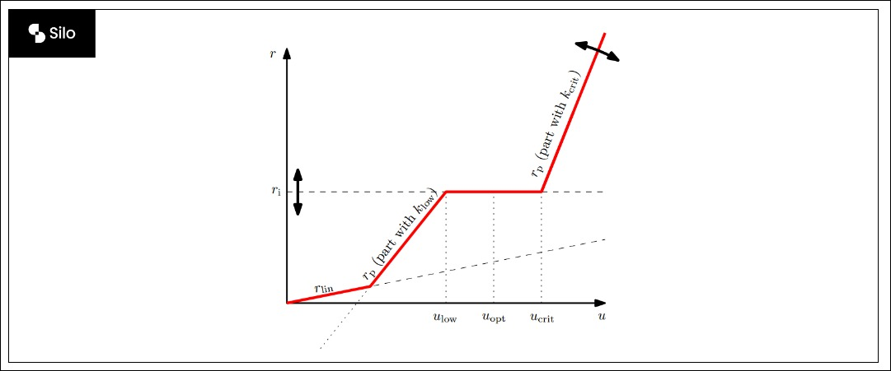

## Silo Core
Silo is the main component of the protocol. It implements lending logic, manages and isolates risk, and acts as a vault for assets. Each lending market is composed of the two Silos for which it was created and is immutable after being created. Creation of the Silo is permission less and can be done via [Silo Factory](https://github.com/silo-finance/silo-contracts-v2/blob/develop/silo-core/contracts/SiloFactory.sol).

||
|:--:| 
| Silo V2 core architecture |

### Silo hooks system
The Silo Protocol Hooks System provides an extensible mechanism for interacting with core actions like deposits, withdrawals, borrowing, repayments, leverage operations, collateral transitions, switching collateral, flash loans, and liquidations. Hooks allow external systems to execute custom logic **before** or **after** protocol actions, offering flexibility for validation, logging, or integration with external contracts. While the protocol is fully functional without hooks, they enhance its modularity and allow for seamless interaction with other decentralized systems. For more information see [Hooks.md](./docs/Hooks.md).

### Liquidations
Liquidations are a core part of the Silo Protocol. They allow users to liquidate undercollateralized positions, which helps maintain the stability of the protocol. Liquidations can be performed when a user's position crosses the liquidation threshold.
Silo liquidation module key concepts:
- Liquidation module is implemented utilizing silo hooks system and is presented as a silo hook. For more details on implementation see [PartialLiquidation.sol](./contracts/utils/hook-receivers/liquidation/PartialLiquidation.sol).
- Liquidation is permissionless and can be performed by any user. Liquidator receives a reward in form of a liquidation fee. The fee for a market is set by the market deployer and can't be updated. Developers can resolve a fee from the [SiloConfig contract](./contracts/SiloConfig.sol).
- The silo liquidation module is designed to do partial liquidations. However, full liquidation can be forced if liquidation leaves some 'dust'.

### Silo is ERC-4626 vault
Each Silo is standardized yield-bearing vault as it implements [ERC-4626 interface](https://github.com/silo-finance/silo-contracts-v2/blob/develop/silo-core/contracts/utils/SiloERC4626.sol). For more information see [ERC-4626 tokenized vault standard](https://ethereum.org/en/developers/docs/standards/tokens/erc-4626/).

### Two types of collateral
When the user deposits into a Silo, they can decide if other users can borrow their deposit to earn interest or if they want their collateral to be protected from being borrowed and be available for withdrawal even if the silo has no available liquidity.

The silo supports two types of collateral:
- **Protected collateral**: This type of collateral cannot be borrowed by other users because of that it does not earn interest. Protected collateral is always available for withdrawal and does not taken into account when calculating available liquidity. The only exception is when the user has a debt, and withdrawing the protected collateral makes him insolvent.
- **Collateral**: This type of collateral can be borrowed by other users, and it earns interest.

### Silo shares tokens
For each asset in a Silo, there are two [ERC-20](https://github.com/silo-finance/silo-contracts-v2/blob/develop/silo-core/contracts/utils/ShareToken.sol) tokens deployed and one [ERC20R](https://github.com/silo-finance/silo-contracts-v2/blob/develop/silo-core/contracts/utils/ShareDebtToken.sol):
- [Vault shares](https://github.com/silo-finance/silo-contracts-v2/blob/develop/silo-core/contracts/utils/ShareCollateralToken.sol) (ERC-20). As due to [EIP-4626 tokenized Vaults specification](https://eips.ethereum.org/EIPS/eip-4626) each Silo implements EIP-20 to represent shares. This token represent a user deposited assets that can be borrowed.
- [Share protected collateral token](https://github.com/silo-finance/silo-contracts-v2/blob/develop/silo-core/contracts/utils/ShareProtectedCollateralToken.sol) (ERC-20). This token represent a user deposited assets that can't be borrowed (Protected collateral).
- [Share debt token](https://github.com/silo-finance/silo-contracts-v2/blob/develop/silo-core/contracts/utils/ShareDebtToken.sol) (ERC20R). This tokens will be minted to represent a debt.

Silo uses the mint and burn functions to operate these underlying tokens. Meanwhile, the transfer is still available and can be used by any third-party application (MetaMask, DEX, etc...). Underlying tokens support hooks and can notify about transfer operation third party smart contract. This simple hook provides enough information to reverse engineer exact action that is happening in the core protocol. See [Share token transfer hook](https://github.com/silo-finance/silo-contracts-v2/blob/develop/silo-core/docs/Hooks.md#share-token-transfer-hook-afteraction) and [Share debt token transfer hook](https://github.com/silo-finance/silo-contracts-v2/blob/develop/silo-core/docs/Hooks.md#share-debt-token-transfer-hook-afteraction) for more information. [GaugeHookReceiver](https://github.com/silo-finance/silo-contracts-v2/blob/develop/silo-core/contracts/utils/hook-receivers/gauge/GaugeHookReceiver.sol) which notifies the [gauge](https://github.com/silo-finance/silo-contracts-v2/blob/develop/ve-silo/contracts/gauges/ethereum/SiloLiquidityGauge.vy#L396) whenever the balance is updated is a good example of how to use share token transfer hook.

### Price oracle
The role of an oracle is to provide Silo with the correct price of an asset. Each oracle to work with Silo should implement [ISiloOracle](https://github.com/silo-finance/silo-contracts-v2/blob/develop/silo-core/contracts/interfaces/ISiloOracle.sol) interface. Price Oracle for each token is optional. Both tokens may have one or just one or none.

Each token may use up to two oracles: [solvency](https://github.com/silo-finance/silo-contracts-v2/blob/7f82b14ee8da33dfdccde99e0fe8c48a0a126aad/silo-core/contracts/interfaces/ISiloConfig.sol#L45) oracle and [maxLtv](https://github.com/silo-finance/silo-contracts-v2/blob/7f82b14ee8da33dfdccde99e0fe8c48a0a126aad/silo-core/contracts/interfaces/ISiloConfig.sol#L46) oracle. Solvency oracle is used to calculate if user is [solvent](https://github.com/silo-finance/silo-contracts-v2/blob/7f82b14ee8da33dfdccde99e0fe8c48a0a126aad/silo-core/contracts/lib/SiloSolvencyLib.sol#L39). MaxLtv oracle is used to decided if user can borrow assets he wants to borrow. MaxLtv is always below liquidation threshold which is a value used for solvency math.

Each token can use solvency and maxLtv oracles, just solvency oracle, just maxLtv oracle or none. If both oracles are setup, each is used for its designed purpose. If only solvency oracle is setup, maxLtv calculations will fallback to using solvency oracle. If only maxLtv oracle is setup, maxLtv calculation will use it but solvency calculations will default prices to "1". If no oracle is setup, all prices are assumed to be "1". In practice, if token0 has no oracle setup, it means token1 has oracle that is returning the price of token1 in token0.
- [Chainlink V3 oracle](https://github.com/silo-finance/silo-contracts-v2/tree/develop/silo-oracles/contracts/chainlinkV3) is an oracle module that is responsible for pulling the correct prices of a given asset from [Chainlink Price Feeds](https://docs.chain.link/data-feeds/price-feeds/addresses?network=ethereum&page=1).
- [Uniswap V3 oracle](https://github.com/silo-finance/silo-contracts-v2/tree/develop/silo-oracles/contracts/uniswapV3) is an oracle module that is responsible for pulling the correct prices of a given asset from [UniswapV3 pools](https://info.uniswap.org/#/pools). It performs security checks and returns TWAP prices when requested.
- [DIA oracle](https://github.com/silo-finance/silo-contracts-v2/tree/develop/silo-oracles/contracts/dia) is an oracle module that is responsible for pulling the correct prices of a given asset from [DIA Price Feeds](https://www.diadata.org/app/source/defi/).

### Interest rate model
The interest rate model is a mathematical algorithm used by the protocol to automatically set the borrowing interest rate (also known as the borrowing APY) and is created for each Silo asset with its configuration. [Silo Interest model V2](https://github.com/silo-finance/silo-contracts-v2/blob/develop/silo-core/contracts/interestRateModel/InterestRateModelV2.sol) is a dynamic interest rate model. In control-theoretic parlance, we designed a [PI controller](https://en.wikipedia.org/wiki/Proportional%E2%80%93integral%E2%80%93derivative_controller#PI_controller) with a deadband in the proportional term and some other modifications. With the current model we achieve following goals:
- Optimal operation where the system reach a stable equilibrium state at an optimal utilization level $Uopt$, i.e., to keep the utilization in a neighborhood of $Uopt$ while holding the interest rate relatively constant.
- Utilization stays below a critical level $Ucrit$ even in volatile market conditions as a safety measure to ensure liquidity.
- Attractive interest rate for borrowers. The interest rate quickly react when utilization drops too low (below a certain level $Ulow$).
- Guaranteed returns on deposits even if the utilization is low, Silo interest rate model will keep small but non-zero interest rate.

||
|:--:| 
| Silo interest rate model visualization |

### Silo EIP-3156
Silo provides standard interfaces and processes for single-asset flash loans([IERC3156FlashBorrower](https://github.com/silo-finance/silo-contracts-v2/blob/develop/silo-core/contracts/interfaces/IERC3156FlashBorrower.sol), [IERC3156FlashLender](https://github.com/silo-finance/silo-contracts-v2/blob/develop/silo-core/contracts/interfaces/IERC3156FlashLender.sol)). For more information see [EIP-3156](https://eips.ethereum.org/EIPS/eip-3156)
