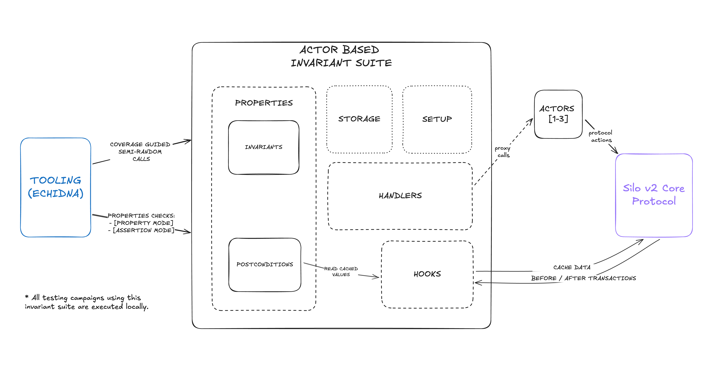

# Actor Based Invariant Testing Suite Silo v2 Core

 

Developed by [vnmrtz.eth](https://x.com/vn_martinez_) from [Enigma Dark](https://www.enigmadark.com/).

 

The Actor Based Invariant Testing Suite is a framework for performing comprehensive invariant testing of the Silo v2 Core protocol. Using an actor-based model, it simulates realistic scenarios with various entities interacting with the system, ensuring that protocol invariants and postconditions hold under an extensive range of conditions.

The suite is designed to support multi-actor tooling, randomizing actions, parameters, actor roles, and asset selection to explore edge cases and ensure the robustness of a protocol.

# Specifications

Extensive documentation regarding the architecture and design of the suite can be found [HERE](./docs/overview.md).

Further documentation outlining the properties of the system (both invariants and postconditions) can be found [HERE](./specs/).

# Tooling

The suite has been developed and tested using the following tools:

- [Echidna](https://github.com/crytic/echidna): A battle tested property-based testing tool for Ethereum smart contracts.

# Setup Instructions:

Instructions for setting up the project and running the testing suite with echidna are available [HERE](./docs/internal-docs.md).

## Additional notes

- Ensure you have the latest version of dependencies both tooling and protocol dependencies installed before running the tests.
- The suite is designed to be modular and extensible, allowing for easy integration of new properties and actors.
- The suite supports integration with github actions, allowing for automated testing as part of the development workflow.

This suite was developed by Enigma Dark after being engaged by Silo Finance to provide security services for the Silo v2 protocol, ensuring that best practices in security and testing are satisfied.
