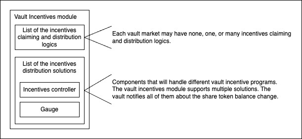
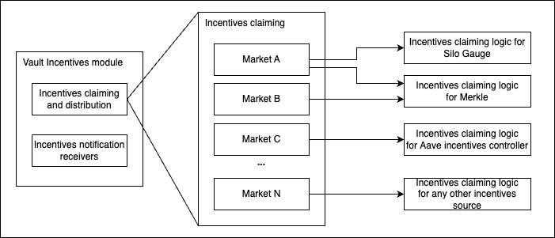
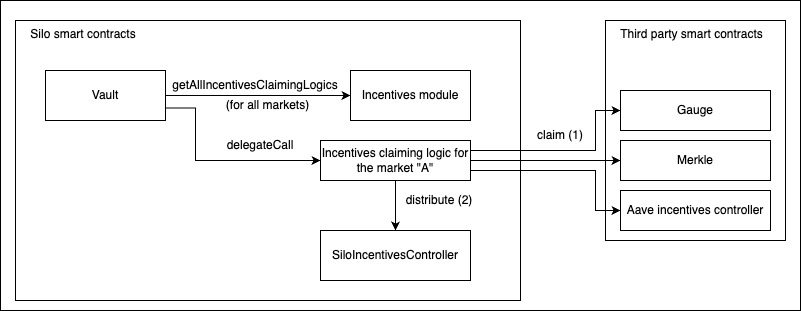

# Silo Vault incentives

Silo vaults support two types of incentive distributions: immediate distributions (whatever was received should be immediately available to withdraw) and any other type like a time-based silo incentives controller or gauge, or both at the same time.

||
|:--:| 
| Fig. 1 - Vault incentives module solutions for incentives distribution |

### Claiming and distributing Vault market incentives
Each market that is available in the vault may (will) have different incentives programs. These programs will differ not only in the solutions that will be used for them but also in their start/end dates, which requires us to be able to claim incentives from new sources or stop trying to claim from the finished incentives programs.To be able to handle it, each market have configurable rewards claiming logics, which are implemented in a separate smart contracts. The vault executes these incentives claiming logic via delegate call. See Fig. 2, Fig. 3.

||
|:--:| 
| Fig. 2 - Incentives claiming and distribution logic |

The vault executes incentives claiming/distribution logic via delegate call so it can claim rewards as vault if needed.

||
|:--:| 
| Fig. 3 - Incentives claiming and distribution logic execution |

For the distribution, incentives claiming logic use a feature for immediate incentives distribution from the SiloIncentivesController. See immediateDistribution fn.