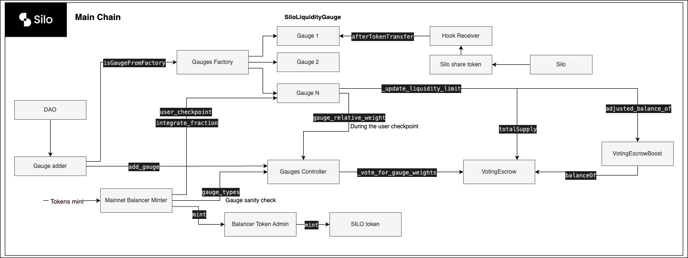
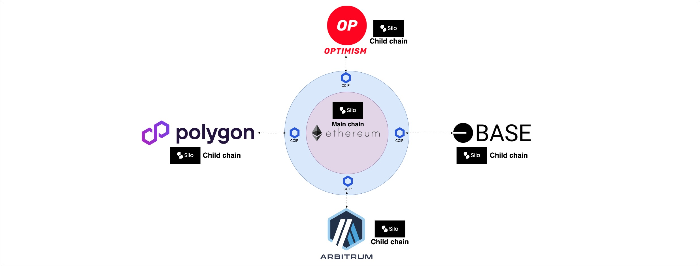
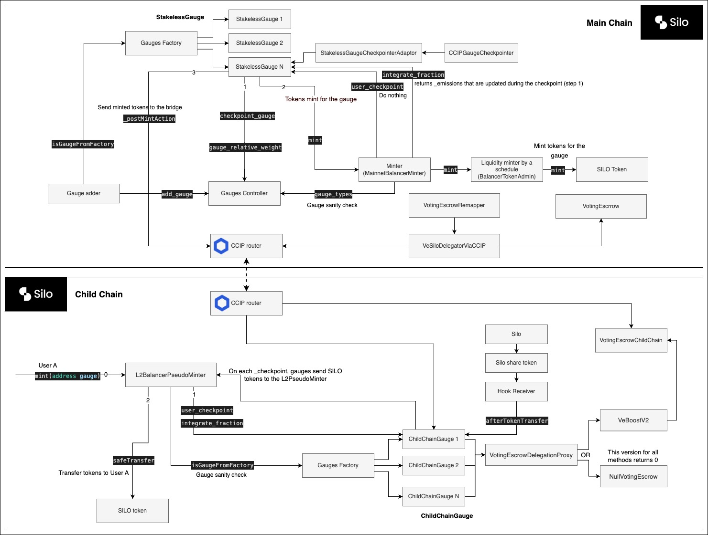

## Silo V2 Liquidity Mining System

This is a fork of the [Balancer V2 liquidity mining system](https://github.com/balancer/balancer-v2-monorepo/tree/master/pkg/liquidity-mining).
More details [here](./docs/forking.md).

The system can be divided into three main component groups: Voting Escrow, Liquidity gauges, and Liquidity mining, which are designed to work as a single-chain or a multi-chain solution or both, as we have in Silo.

||
|:--:| 
| Silo V2 Liquidity Mining System architecture - L1 |

### Voting Escrow
A Voting Escrow component provides an ability for the user to lock Silo 80/20 BAL tokens and receive, in return, so-called 'voting power'. It allows the user to participate in the protocol governance, vote for gauges, and receive incentives in a SILO token, receiving a share of the protocol fees that are collected from the protocol operations.

### Gauges
Gauges in the Silo protocol are extensions of the Silo. They are permanently connected with the Silo via the Silo hooks feature and can't be updated/removed. This kind of design opens the way new user experience as no additional actions from the user are required for work with gauges after the user deposited liquidity into the Silo. As the gauge is an extension of the Silo, the Silo deposits share tokens perform the user balance accounting, and a gauge allows the user to vote and receive incentives based on the VeSilo voting power and deposited balance in the Silo.

### SILO Tokens mining
SILO tokens will be minted to incentivize users participating in the SILO protocol. SILO tokens minting program have an initial inflation rate of 145k SILO tokens weekly with the reduction rate `2 ** (1/4) * 1e18`. Periodically (every year), the SILO inflation rate will be reduced by the reduction rate:
| Epoch | Inflation rate |
| --- | --- |
| 0 | 145k |
| 1 | ~122k |
| 2 | ~102k |
| ... | ... |
| 5 | ~60k |

## Silo V2 Liquidity Mining multi-chain

Silo V2 Liquidity Mining system to become a multi-chain system should provide the ability of SILO tokens and a VeSilo voting power transfer into child chains for its users. To achieve this, the system has a set of components on the main chain (Ethereum) that are connected with child chain components via Chainlink Cross-Chain Interoperability Protocol (CCIP).

||
|:--:| 
| Silo V2 Liquidity Mining multi-chain system (One to many EXAMPLE) |

||
|:--:| 
| Silo V2 Liquidity Mining multi-chain system architecture |

### Voting Escrow multi-chain

Multi-chain functionality of the Silo V2 voting escrow provides an ability for the user to sync its VeSilo voting power into any child chain via Chainlink CCIP. But still, all voting for gauges happens in the main chain (Ethereum), while incentives users will collect in the child chain.

### Gauges multi-chain

To achieve a multi-chain protocol architecture, two types of gauges were designed: `StakelessGauge` (main chain) and `ChildChainGauge` (child chain). `StakelessGauge` is like a presenter of the `ChildChainGauge` in the main chain. All voting for a gauge happens in the main chain, while incentives for distribution are transferred to the child chain gauge. So, users vote for the `StakelessGauge` which later on receive all incentives and transfer them via CCIP to the child chain gauge.
